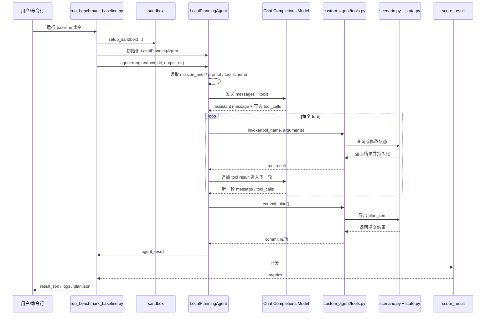

# 仓库导览：Agent 相关结构

这份文档给第一次接触本仓库、但主要想理解 **agent 相关代码** 的读者。

这里默认你实际使用的启动命令是 `run_benchmark_baseline.py`。
所以本文只围绕这条本地 baseline agent 路径展开，不介绍完整 benchmark 主 runner。

## 1. 一句话先讲清楚

如果只看 agent，可以把这条链路记成：

`run_benchmark_baseline.py -> agent_loop.py -> tools.py -> scenario.py/state.py -> plan.json -> score`

也就是：

- `run_benchmark_baseline.py` 负责准备环境并启动 agent
- `agent_loop.py` 负责和模型对话、决定下一步做什么
- `tools.py` 负责把规划环境包装成可调用工具
- `scenario.py` / `state.py` 负责真正的状态、约束和落盘
- 最终产物是 `plan.json`

## 2. Agent 代码主要在哪

### 通用 benchmark 路径

主要看这些文件：

- `src/benchmark/run_benchmark_baseline.py`
- `src/benchmark/custom_agent/agent_loop.py`
- `src/benchmark/custom_agent/tools.py`
- `src/benchmark/custom_agent/tool_profiles.py`
- `src/benchmark/custom_agent/prompts/`
- `src/planner/scenario.py`
- `src/planner/state.py`
- `src/planner/mcp_server.py`

### SatNet 路径

主要看这些文件：

- `src/satnet_agent/run_benchmark_baseline.py`
- `src/satnet_agent/custom_agent/agent_loop.py`
- `src/satnet_agent/custom_agent/tools.py`
- `src/satnet_agent/custom_agent/tool_profiles.py`
- `src/satnet_agent/custom_agent/prompts/`
- `src/satnet_agent/scenario.py`
- `src/satnet_agent/state.py`
- `src/satnet_agent/mcp_server.py`
- `src/satnet_agent/scorer.py`

## 3. 最重要的文件：`agent_loop.py`

如果你只想先看一个文件，优先看 `agent_loop.py`。

它是本地 custom agent 的主循环，负责把“模型能说话”变成“模型真的会调用工具并产出 plan”。

### `agent_loop.py` 主要做什么

通常它会按下面顺序工作：

1. 读取 `mission_brief.md`
2. 加载 prompt
3. 根据 `tool_profiles.py` 生成 tools schema
4. 初始化消息历史 `messages`
5. 先让模型写一个简短的执行计划
6. 进入主循环
7. 每一轮把 `messages + tools` 发给模型
8. 读取模型返回的 `content` 和 `tool_calls`
9. 如果有 `tool_calls`，就调用 `tools.py` 执行
10. 把工具结果以 `role="tool"` 的形式加回 `messages`
11. 继续下一轮，直到 `commit_plan` 成功或达到最大 turn 数

### 一个 turn 是什么

在这里，**一个 turn 是一轮模型响应**，不是一次工具调用。

一个 turn 内可能发生的事情是：

- agent 向模型发一次请求
- 模型返回一条 assistant message
- 这条 message 里带 0 个、1 个或多个 `tool_calls`
- agent 执行这些 tool calls
- 把结果写回消息历史
- 然后才进入下一个 turn

所以要记住：

- `turn != tool call`
- 一个 turn 里可能调用多个工具

### 为什么 `agent_loop.py` 最关键

因为下面这些行为都集中在这里：

- prompt 是怎么组装的
- 工具 schema 是怎么暴露给模型的
- 模型输出是怎么解析的
- tool result 是怎么反馈回下一轮上下文的
- 什么时候认为 agent 出错了
- 什么时候触发 repair
- 什么时候认为任务完成

如果你遇到这些问题，几乎都先看 `agent_loop.py`：

- 模型没有调工具
- 模型一直空转
- 模型输出了伪工具调用文本
- agent 过早结束
- agent 一直不结束
- 明明 `commit_plan` 成功了却没停

### `agent_loop.py` 里常见的几个逻辑块

#### 1. schedule planning 阶段

很多实现会先让模型在不调用工具的情况下，写一个粗略执行计划。

作用是：

- 先让模型形成高层策略
- 减少一上来盲目乱调工具
- 把后续执行变成“按计划验证和修正”

#### 2. 主循环

主循环通常就是：

- 发请求
- 取返回
- 执行工具
- 追加工具结果
- 下一轮

这是标准的 tool-calling agent 回路。

#### 3. repair 逻辑

模型有时不会真正返回 `tool_calls`，而是输出类似：

- “我现在调用 xxx 工具”
- `<tool_call>...</tool_call>`
- 伪代码式函数调用

这时候 `agent_loop.py` 一般会插入一条 repair message，要求模型重新按真正的 structured tool call 返回。

#### 4. 终止条件

最常见的终止条件有两个：

- `commit_plan` 成功
- 达到 `max_turns`

所以要判断一次 run 为什么停了，通常直接看：

- `stop_reason`
- 最后一个 turn 的 tool result
- `commit_plan` 返回值

## 4. `tools.py`：agent 真正调用的本地工具层

`tools.py` 不是模型，也不是状态机，它是二者之间的桥。

它的职责通常是：

- 根据 sandbox 路径初始化状态
- 提供一组“按工具名调用”的 Python 方法
- 调 scenario 执行查询、修改、提交
- 在变更后持久化 state
- 把结果整理成模型容易消费的 dict

可以把它理解成：

- `agent_loop.py` 决定“调用哪个工具”
- `tools.py` 负责“把这个工具真正执行掉”

## 5. `tool_profiles.py`：模型能看到什么工具

这个文件决定 agent 暴露给模型的工具长什么样。

它主要负责：

- 工具名字
- 工具描述
- 参数 schema
- 允许哪些工具出现在当前任务里

如果 agent 总是不会正确调工具，优先检查两件事：

1. `tool_profiles.py` 里的 schema 对不对
2. `tools.py` 里的真实参数签名对不对

这两个文件不一致时，agent 经常会“看起来会想，但下不了手”。

## 6. `mcp_server.py` 和 `custom_agent/tools.py` 的关系

这是最容易搞混的点。

### `mcp_server.py`

- 更像仓库里的正式工具接口
- 面向 MCP 风格的 agent 交互
- 定义“这个规划环境官方提供哪些工具”

### `custom_agent/tools.py`

- 面向本地 baseline agent
- 不启动独立 MCP 进程
- 直接在 Python 里调用 scenario
- 但接口风格尽量和 MCP 工具保持一致

简单说：

- 想看“官方工具面”，先看 `mcp_server.py`
- 想看 baseline agent 实际怎么跑，重点看 `custom_agent/tools.py`

## 7. `scenario.py` / `state.py`：agent 背后的真实环境

agent 本身不保存完整规划语义，它只是不断发起动作。
真正的规划状态在 `scenario.py` 和 `state.py`。

### `scenario.py`

这里负责：

- 查询当前对象和状态
- 计算窗口或可行操作
- 校验约束
- 修改当前计划
- 导出最终 `plan.json`

### `state.py`

这里负责：

- 把可变状态持久化到文件
- 让多轮工具调用看到一致状态
- 支持 run 结束后的复盘和评分

如果 agent “会调用工具但结果怪”，根因经常在这里，而不是 prompt。

## 8. 启动到 `plan.json` 的时序图

下面这个图只描述 **baseline agent 路径**。

## 9. 推荐阅读顺序

### 如果你看通用 benchmark agent

1. `src/benchmark/run_benchmark_baseline.py`
2. `src/benchmark/custom_agent/agent_loop.py`
3. `src/benchmark/custom_agent/tools.py`
4. `src/benchmark/custom_agent/tool_profiles.py`
5. `src/planner/scenario.py`

### 如果你看 SatNet agent

1. `src/satnet_agent/run_benchmark_baseline.py`
2. `src/satnet_agent/custom_agent/agent_loop.py`
3. `src/satnet_agent/custom_agent/tools.py`
4. `src/satnet_agent/custom_agent/tool_profiles.py`
5. `src/satnet_agent/scenario.py`

## 10. 调 agent 时最常看的输出

如果一次 run 行为不对，优先看：

- `logs/model_requests.jsonl`
- `logs/model_responses.jsonl`
- `logs/tool_calls.jsonl`
- `logs/agent_parsed_log.txt`
- `agent_transcript.json`
- `plan.json`

最推荐的排查顺序是：

1. 模型看到了什么 prompt 和 tools
2. 模型实际返回了什么 `tool_calls`
3. 工具执行结果是什么
4. `commit_plan` 为什么成功或失败
5. 最终 `plan.json` 是什么

## 11. 最后压缩成一句话

这个仓库里的 baseline agent 可以简单理解成：

- `run_benchmark_baseline.py` 负责启动
- `agent_loop.py` 负责决策
- `tools.py` 负责执行工具
- `scenario.py/state.py` 负责维护真实规划状态
- `plan.json` 是最终产物

先把这条链看顺，再去看具体 benchmark 细节，会轻松很多。
